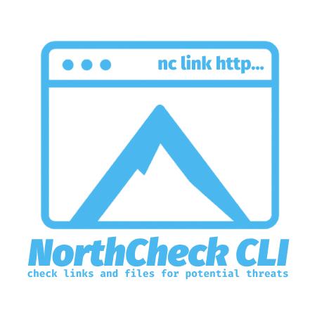

# NorthCheck

<div align="center">
  
  <br />
  <span>
    A CLI tool to check links and files for <br>potential threats using NordVPN APIs.
  </span>
</div>


## Installation

```bash
npm install -g northcheck
```

The package provides two command aliases: `northcheck` and `nc`.

### Autocompletion Setup

During installation, a `postinstall` script automatically sets up autocompletion:

- **Linux/macOS**: Bash completion is automatically configured
- **Windows**: PowerShell completion is automatically configured

**Important:** For the autocompletion to take effect:
- **Linux/macOS**: Run `source ~/.bashrc` or restart your terminal
- **Windows**: Restart PowerShell or run `. $PROFILE`

## Usage

The CLI provides three main commands: `link`, `file`, and `hash`.

### 1. Check a URL (`link` command)

Checks a given URL for potential threats using NordVPN's link checker API.

```bash
nc link <url> [options]
# or
northcheck link <url> [options]
```

**Arguments:**
- `<url>`: The URL to check.

**Options:**
- `--json`: Output the raw JSON response from the API.

**Example:**
```bash
nc link https://example.com
nc link https://malicious-site.com --json
```

### 2. Check a File (`file` command)

Checks a local file for potential threats using NordVPN's file hash checker API. This command calculates the SHA256 hash of the file and checks it against NordVPN's database of known malicious files.

```bash
nc file <filePath> [options]
# or
northcheck file <filePath> [options]
```

**Arguments:**
- `<filePath>`: The path to the local file to check.

**Options:**
- `--json`: Output the raw JSON response from the API.
- `--hash <sha256>`: Use provided SHA256 hash instead of calculating from file
- `--size <bytes>`: File size in bytes (required when using --hash)
- `--name <filename>`: File name (optional when using --hash)

**Examples:**
```bash
# Check a local file (normal mode)
nc file ./my_document.pdf
nc file /home/user/downloads/suspicious.exe --json

# Check using manual hash (hash mode)
nc file dummy --hash abc123def456... --size 1024 --name example.exe
nc file dummy --hash ec779b8c93166553b635cbfafdae08612847ec3e5ac13fde98d911d1937f8060 --size 34140 --name logo.png

# Windows examples:
nc file "C:\Users\username\Downloads\suspicious.exe"
nc file dummy --hash abc123... --size 2048 --name "My File.exe"
```

### 3. Check a Hash (`hash` command)

Check a SHA256 hash directly for potential threats. Useful when you have a hash but not the file, or when you want to verify a hash from another source.

```bash
nc hash <sha256> [options]
# or
northcheck hash <sha256> [options]
```

**Arguments:**
- `<sha256>`: The SHA256 hash to check (64 hexadecimal characters).

**Options:**
- `--json`: Output the raw JSON response from the API.
- `--size <bytes>`: File size in bytes (optional, for better accuracy).
- `--name <filename>`: File name (optional, for reference).

**Examples:**
```bash
# Check a hash with minimal info
nc hash abc123def4567890abcdef1234567890abcdef1234567890abcdef1234567890

# Check a hash with additional context
nc hash ec779b8c93166553b635cbfafdae08612847ec3e5ac13fde98d911d1937f8060 --size 34140 --name logo.png

# Check multiple hashes from a list
echo "hash1\nhash2\nhash3" | while read hash; do nc hash $hash; done
```

## How File Checking Works

The file checking uses **hash-based detection**, not content analysis:

1. **Local Processing**: The file is read locally and its SHA256 hash is calculated
2. **Hash Submission**: Only the hash, file size, and filename are sent to NordVPN's API
3. **Database Lookup**: NordVPN checks the hash against their database of known malicious files
4. **Privacy**: Your file content is never uploaded or analyzed

**Benefits:**
- ⚡ **Fast**: No file upload required
- 🔒 **Private**: Only hash is transmitted, not file content
- 🛡️ **Secure**: Checks against millions of known malicious file hashes

## API Integration

NorthCheck integrates with NordVPN's security APIs:

- **Link Checker API**: `https://link-checker.nordvpn.com/v1/public-url-checker/check-url`
- **File Hash Checker API**: `https://file-checker.nordvpn.com/v1/public-filehash-checker/check`

The tool automatically handles:
- API authentication headers
- File hash calculation (SHA256)
- File metadata extraction
- Risk assessment display
- Cross-platform path handling

## Risk Assessment

The tool provides risk assessment with the following levels:
- **Very High**: Score 90-100
- **High**: Score 70-89
- **Moderate**: Score 40-69
- **Low**: Score 10-39
- **Very Low**: Score 0-9

## Autocompletion

### Linux/macOS (Bash)
Once autocompletion is set up, you can use the `Tab` key for:
- Completing `nc` or `northcheck` commands
- Completing subcommands like `file`, `link`, or `hash`
- Autocompleting file paths after `nc file `
- Autocompleting options like `--json`, `--hash`, `--size`, `--name`

### Windows (PowerShell)
PowerShell autocompletion provides:
- Command and subcommand completion
- File path suggestions for the `file` command
- Option completion (--json, --hash, --size, --name, etc.)

**Example:**
Type `nc file test` and press `Tab` to autocomplete `test.txt` (if it exists in the current directory).

## Cross-Platform Compatibility

NorthCheck is fully compatible with:
- **Windows**: Command Prompt and PowerShell
- **Linux**: All major distributions
- **macOS**: Terminal and iTerm2

### Platform-Specific Features
- **Windows**: Automatic PowerShell profile configuration
- **Linux/macOS**: Automatic bash completion setup
- **All platforms**: Platform-specific User-Agent strings for better API compatibility

## Features

- **URL Threat Detection**: Check URLs for malicious content using NordVPN's link checker
- **File Security Analysis**: Analyze local files using SHA256 hash checking against known malicious files
- **Hash Verification**: Check SHA256 hashes directly without needing the original file
- **Manual Hash Input**: Use pre-calculated hashes with the file command
- **Risk Scoring**: Get detailed risk assessments with categories
- **JSON Output**: Option to get raw API responses for advanced usage
- **Cross-Platform Autocompletion**: Enhanced command-line experience with tab completion
- **Error Handling**: Comprehensive error messages and troubleshooting guidance
- **Timeout Protection**: 30-second timeout for API requests
- **File Access Validation**: Automatic file existence and permission checking
- **Privacy-First**: Only file hashes are transmitted, never file content

## Use Cases

### File Analysis
- Check downloaded files before opening
- Verify software installers
- Analyze suspicious documents

### Hash Verification
- Verify hashes from security reports
- Check hashes from file sharing sites
- Validate file integrity

### Batch Processing
- Check multiple files in a directory
- Process hash lists from security tools
- Integrate with automated workflows

## Requirements

- Node.js >= 14.0.0
- Internet connection
- Bash shell (for autocompletion on Linux/macOS)
- PowerShell (for autocompletion on Windows)

## Troubleshooting

### Common Issues

**File not found error:**
- Ensure the file path is correct
- Use quotes around paths with spaces: `nc file "My File.pdf"`
- On Windows, use forward slashes or escaped backslashes: `nc file "C:/Users/name/file.txt"`

**Invalid hash format:**
- SHA256 hashes must be exactly 64 hexadecimal characters
- Example: `abc123def4567890abcdef1234567890abcdef1234567890abcdef1234567890`

**Permission denied:**
- Check file permissions
- On Windows, run PowerShell as Administrator if needed

**Network errors:**
- Check your internet connection
- Verify firewall settings
- Try again in a few minutes

**File too large:**
- The tool works with files of any size (only hash is calculated)
- Very large files may take longer to process due to hash calculation time

## License

MIT

---

### Support the Project

If you find northcheck cli useful, consider supporting its development:

[](https://liberapay.com/devbyben/donate)

Your support helps maintain and improve northcli